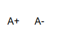

English | [简体中文](./readme_cn.md)
# Description
A plugin for [docsify](https://github.com/docsifyjs/docsify)

Create two buttons in the top left corner that allow users to customize the font size

[example](https://techmc.wiki/#/)

# Install
``

# NightModeCompatible

Compatible with the [docsify-dark-switcher plugin](https://github.com/LIGMATV/docsify-dark-switcher), if you want to use the following styles, please import the darkmode.css in the repository

`<link rel="stylesheet" href="//cdn.jsdelivr.net/gh/SDU-Little-River/docsify-fontsize@latest/darkmode.css">`

| light              | dark               |
|--------------------|--------------------|
|  |  |

## compatibilityFix
Fix a bug,The [docsify-dark-switcher](https:github.comLIGMATVdocsify-dark-switcher) plugin was not compatible with night mode

| origin             | fixed              |
|--------------------|--------------------|
|  |  |
