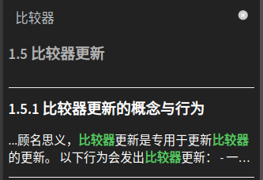

[English](./readme.md) | 简体中文
# 简介
在左上角创建两个按钮，允许用户自定义字体大小

[示例](https://techmc.wiki/#/)
# 安装
``
最好在本地下载后再使用

# 夜间模式兼容
和[docsify-dark-switcher](https://github.com/LIGMATV/docsify-dark-switcher)插件兼容，如果你想使用如下样式，请引入仓库中的darkmode.css

`<link rel="stylesheet" href="//cdn.jsdelivr.net/gh/SDU-Little-River/docsify-fontsize@latest/darkmode.css">`

| 日间模式               | 夜间模式               |
|--------------------|--------------------|
|  |  |

## 兼容性修复
修复了[docsify-dark-switcher](https://github.com/LIGMATV/docsify-dark-switcher)插件与夜间模式不兼容的bug

|                    |                    |
|--------------------|--------------------|
|  |  |

